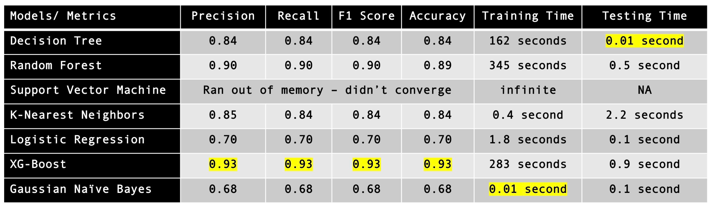
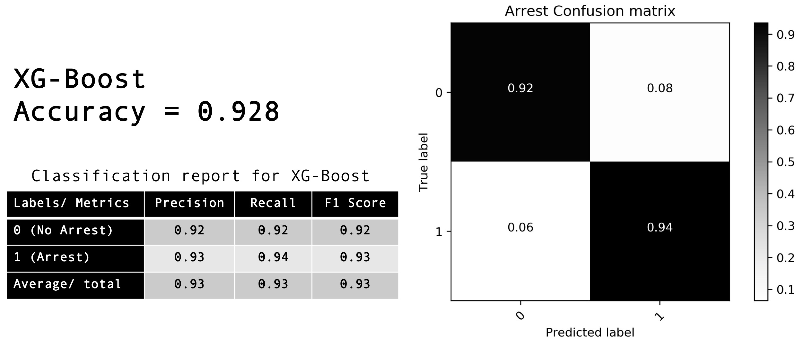

<p align="center">
	 
</p>

## Introduction

The main goal of this project is prediction of safety at a specific location and a particular time. Crimes are a common social problem affecting the quality of life and the economic growth of a society [1]. It is considered an essential factor that determines whether or not people move to a new city and what places should be avoided when they travel [2]. With the increase of crimes, law enforcement agencies are continuing to demand advanced geographic information systems and new data mining approaches to improve crime analytics and better protect their communities [3].
Although crimes could occur everywhere, it is common that criminals work on crime opportunities they face in most familiar areas for them [4]. By providing a predictive machine learning approach to determine the criminal hotspots and the location, time of committed crimes, people’s awareness can be raised regarding the dangerous locations in certain times. Therefore, this project can potentially help people stay away from the locations at a certain time of the day along with saving lives. In addition, having this kind of knowledge can help people to improve their living place choices. On the other hand, police forces can use this solution to increase the level of crime prediction and prevention. Moreover, this would be useful for police resources allocation. [6] It can help in the distribution of police at most likely crime places for any given time, to grant an efficient usage of police resources [5]. By having all of this information available, we hope to make our community safer for the people living there and also for others who will travel there. [6]
In this project, I created a web application that receives an address or location and time arguments in Chicago from the user and predicts the probability of crime (hence safety) at a specific location and a particular time, it also searches for crime incidents nearby (100m radius) and marks them on the map as well as listing them in the area and saving the previous searches.

## Data Source

The <a href="https://data.cityofchicago.org/Public-Safety/Crimes-2001-to-present/ijzp-q8t2/data" target="_blank">data</a> is Chicago crime dataset from City of Chicago Data Portal. I used ~1.5 years of data (2017 and 5 months of 2018) for computation efficiency reasons, this gives about 350K crime reports. Each crime has 22 columns of information associated with it. Information like location of the crime, crime and location descriptions, type and date of crime, arrest made or not, etc.

 

### Data pre-processing

Data was cleaned and preprocessed before modeling. Dropped the duplicates, the NA values. Also parsed the date column single date and time stamp and broke it into components (year, month, day, hour, minute). Also, used label encoder function to one hot encode the arrest labels.

### Data balancing

From the 350K crime reports, in only about 68K the arrest was made (arrest == True) and the rest no arrest was made. Since the classification is on arrest made or not, it's important to balance the data so there are similar counts for each class. This was done using a combination of over- and under-sampling. There are systematic algorithms that you can use to generate synthetic samples available in sklearn library. I used SMOTENN or the Synthetic Minority Over-sampling Technique. 

### Data train and test split

The data was split into training and testing sets. 80% of data assigned for learning and training and the remaining 20% of data assigned for testing purposes.

## Feature Selection

The more relevant features picked for predicting crimes in which arrest was made (and therefore predicting safety) are crime date and time (day, month, year, hour, minutes) and crime location (latitude and longitude). In future work, I would add the ability to classify the crime-type in addition to possiblity of crime (safety) at a specific location and time.


## Modeling

I did grid search modeling, prediction and evaluation using different machine learning algorithms, namely: Logistic Regression, Naive Bayes, Support Vector Machines, K-Nearest Neighbors, Decision Trees, Random Forest, and XG-Boosting. From the grid search the best parameters were used to fit each model and use them to predict and evaluate their performance. The results are summarized in the table below:

 

By comparing the models, the model I selected for this classification task is XG-Boost. This model gives the best performance metrics across all categories (precision, recall, F1 score, and accuracy) and although in terms of training and testing speed is not the fastest algorithm but it's not the slowest either. Here are more detail on the XG-Boost classification on arrest made or not:



## Getting Started

When you load the application, you have two options: One is to enter the location and datetime arguments in this format (day, hour, latitude, longitude, minute, month) and click the "is it safe?" button. This will return the probability of safety (crime with arrest not happening). For example in the case below user searched for West Ridge area (west side of Chicago) and predicted 0.04 chance of safety or 96% chance of crime at that time, date and location.  

<p align="center">
	
</p>

Two is to enter your desired address in the search box, Google will automatically complete the address. Click the "find the crimes" button. The page will center and zoom in the map, marking all the crimes within 100 meters radius in the area. Hover over the markers to find more information about the crime such as, description, block and date of the crime incident. You can select the 'Street View' to look and move around for better visualization of the incidents. To see the complete results list, click on the 'View Results List' button on the page. The application will also save the last three searches, you can see the previous searches by clicking on the 'Previous Searches' button.

<p align="center">
	
</p>

## What's included

Within the project folder you can find the following directories and files. You'll see something like this:

```
safeinthecity/
├── templates/
│  	└── index.html/
├── static/
│  	└── assets/
│		 └── css/
│		 │   ├── reset.css
│	 	 │   └──  style.css	
│		 └── js/
│			 ├── crime-api.js
│			 └── google-map-api.js
├── api.py
├── app.py (flask app)
├── scaler.pkl
├── xgboost.pkl 
├── crime_model.ipynb (main notebook)
├── requirements.txt
├── README.md
└── readme
	└── python_logo.png
	└── flask.png
 	└── css.png
 	└── html.png
	└── js.png
	└── git.png
	└── firebase.png
	└── terminal.png
	└── chicagoapi.png
	└── mapsapi.png
	└── numpy_logo.png
```

## Contributing

Please feel free to submit pull requests for development. The following instructions will get you a copy of the project up and running on your local machine for development and testing purposes.

### Prerequisites

You need the following software for testing and development:

- Python (version 3)
- Command line interface
- Web browser (Microsoft Edge, Firefox, Chrome and Safari supported)
- Source code editor like Atom or Sublime Text
- Git source control manager

### Cloning Repository

Start by opening the command line and downloading the repository as follows

```bash
git clone https://github.com/BabakShah/DS-SafetyPrediction.git
```

change the directory to the project folder and the desired source file (Python, HTML, CSS, JS)

```bash
cd ./DS-SafetyPrediction/
```

in the command line, download all the python library dependencies

```bash
pip install -r /path/to/requirements.txt
```

to launch the webapp

```bash
python app.py
```

open the following page in browser

```bash
http://127.0.0.1:5000/
```

for further development, open the source files in a source code editor. For Python scripts

```bash
open -a "Sublime Text" file-name
```

for IPython notebooks

```bash
jupyter notebook file-name
```


## Built With

* Python  
* HTML 
* CSS 
* JS 
* Firebase 
* Flask 
* Git 
* Command Line Interface 

## APIs

 
<b>Google Maps API:</b> https://developers.google.com/maps/
<br>

<b>Chicago Crime API:</b> http://api1.chicagopolice.org/clearpath/

## Libraries used

* Scikit-learn
* Matplotlib 
* Numpy 
* Pandas 
* Jupyter Notebook 
* Moment.js 

## References
[1] A.  Bogomolov,  B.  Lepri,  J.  Staiano,  N.  Oliver,  F.  Pianesi  and  A.  Pentland,  'Once  Upon  a  Crime: Towards Crime Prediction from Demographics and Mobile Data', CoRR, vol. 14092983, 2014. 

[2] R.  Arulanandam,  B.  Savarimuthu  and  M.  Purvis,  'Extracting  Crime  Information  from  Online Newspaper  Articles',  in  Proceedings  of  the  Second  Australasian  Web  Conference  -  Volume  155, Auckland, New Zealand, 2014, pp. 31-38. 

[3]  A. Buczak and C. Gifford, 'Fuzzy association rule mining for community crime pattern discovery', in ACM SIGKDD Workshop on Intelligence and Security Informatics, Washington, D.C., 2010, pp. 1-10. 

[4]  M. Tayebi, F. Richard and G. Uwe, 'Understanding the Link Between Social and Spatial Distance in the Crime World', in Proceedings of the 20th International Conference on Advances in Geographic Information Systems (SIGSPATIAL '12), Redondo Beach, California, 2012, pp. 550-553. 
 
[5]  S.  Nath,  'Crime  Pattern  Detection  Using  Data  Mining',  in  Web  Intelligence  and  Intelligent  Agent Technology  Workshops,  2006.  WI-IAT  2006  Workshops.  2006  IEEE/WIC/ACM  International Conference on, 2006, pp. 41,44. 
 
[6] T. Almanie, R. Mirza, and E. Lor, “Crime prediction based on crime types and using spatial and temporal criminal hotspots,” arXiv preprint arXiv:1508.02050, 2015.

## Contact me
**Babak** - [email](shahianb@gmail.com)

<!--## Acknowledgments
* Hat tip to anyone who's code was used
* Inspiration
* etc-->

